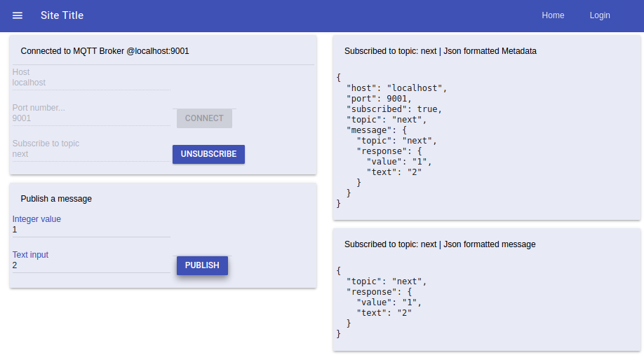

Originally forked from
[mqtt angular2 example](https://github.com/sclausen/angular2-protobuf-mqtt-example)

Modified with multiple observers for de-coupling components for
separation of privileges and monitoring of topic, displaying the
latest queue message.

Communication uses websocket and protobuf.

Original project info:

---
## Screen captures of example 

#### angular2 / mqtt / protocol buffer monitor application





Some functionality added for configuring and testing / monitoring
added.

- mqtt host/port input
- topic input
- value submission
- monitors for the current topic
  - metadata 
  - message 

---
## Branches per UI test 

Different branches have different package.json requirements, for the UI frameworks.

bootstrap 

    "bootstrap": "^3.3.7",

bootstrap-4-alpha-cards

    "bootstrap": "^4.0.0-alpha.6",

material-design-lite branch:

    "@angular-mdl/core": "^3.0.0-beta.1",
    "material-design-lite": "^1.3.0",
    "angular2-mdl": "^2.13.2",
    "material-design-lite": "^1.3.0",

mdl-bootstrap-cards

    "mdbootstrap": "^4.3.0",

---

# Using protobuf with mqtt in angular2
This project is a demonstration of using protobuf with angular2 and mqtt.

The article for this example is located [here](http://blog.sebastian-clausen.de/2017-02-20-reduce-message-payload-in-an-iot-setup/)

## Prequisites
You need a running mqtt server with websocket support under port 9001.
I can recommend [mosquitto](https://mosquitto.org/).
My mosquitto.conf with websockets enabled looks as follows
```
pid_file /var/run/mosquitto.pid

persistence true
persistence_location /var/lib/mosquitto/

log_dest file /var/log/mosquitto/mosquitto.log

listener 1883

listener 9001 127.0.0.1
protocol websockets

include_dir /etc/mosquitto/conf.d
```
You also need angular-cli.
```
npm install -g @angular/cli
```
## Install dependencies
``` sh
npm install
./node_modules/protobufjs/bin/pbjs -t static-module -w commonjs -o ./src/protobuf/value.protobuf.js ./value.proto
./node_modules/protobufjs/bin/pbts -o ./src/protobuf/value.protobuf.d.ts ./src/protobuf/value.protobuf.js
```

## Run the app
Run `ng serve` for a server then navigate to `http://localhost:4200/` to see the example in action.


